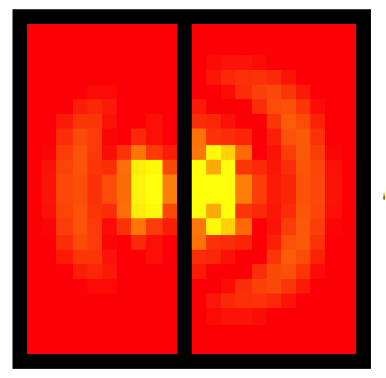

# Introduction
In this project, I have created a wave simulator that uses individual particles, each connected to its neighbors by spring forces. The particles are arranged in a grid with four connections, which as we will see increases the error in the program but also improves computational efficiency. A compromise between analytical and numerical analysis, this program allows the user to get a good qualitative view of waves in a two-dimensional medium, similar to a ripple tank.
# Complete Paper
Here is the [complete paper](doc/spring-lattice-simulator.pdf) including derivations.

# Using the Program
The program requires Wolfram Mathematica to run. The simulation.nb file it comes in provides the source code as well as the final simulator. Little mathematica knowledge is required to run the program, except the order in which to evaluate the functions, which is provided here. The keyboard shortcut Shift+Enter to evaluate is useful here.
After opening the program, you will see all of the code. Scrolling down will reveal a fully functional simulator:

# Interesting Starting Conditions
## Walls
 
 
## 1. Two Radial Waves
`coordsList = basicWalls[size];
xList = waveRadialDouble[xIn[size],{15.5,15.5},{20.5,22.5},coordsList];`

## Radial Wave with Small Point
`coordsList = point[size,20,14];
xList = waveRadial[xIn[size],14.5,10.5,coordsList];`

## Plane Wave with Divider
`coordsList = divider[size,13,y];
xList = wavePlane[xIn[size],x,10,coordsList];`

## Plane Wave with Slit
`coordsList = slit[size,9,x,4];
xList = wavePlane[xIn[size],x,5,coordsList];`

 

